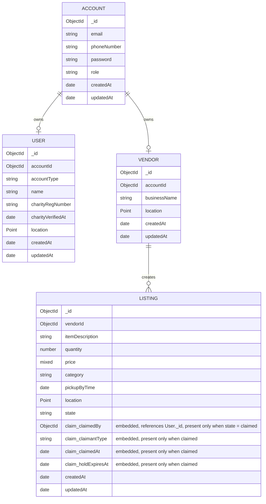

# Entity Relationship Diagram

## Relationships

- Every Account owns exactly one User profile or one Vendor profile.
- A Vendor can create many Listings.
- Claim data is embedded directly on each Listing (see the `claim_*` fields) — there is no separate Claim collection. These fields are only populated once a listing's `state` becomes `claimed`.
- Listings use MongoDB GeoJSON (`2dsphere`) indexes for location-based searches.