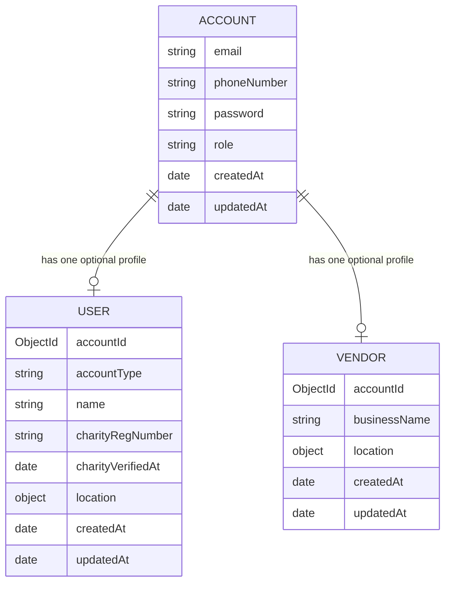

# Entity Relationship Diagram

Notes from the current schema:
- `User.accountId` and `Vendor.accountId` are both `required` and `unique` references to `Account`.
- In this implementation, an `Account` is expected to have either a `User` profile or a `Vendor` profile, not both.

| Planned model | Status | Note |
| --- | --- | --- |
| Listing | Planned | Scheduled for later in the sprint. |
| Claim | Planned | Scheduled for later in the sprint. |
